# License Plate Number Recognizer

Сервис, предназначенный для распознавания регистрационных номеров автомобилей по изображениям.

## Содержание
- [Про модель](#про-модель)
- [Производительность](#производительность)
- [Начало работы](#начало-работы)
- [Использование](#использование)

## Про модель

Моя модель обучена на более чем 60 тысячах изображений с регистрационными номерами автомобилей. После успешного обучения она была протестирована на 5 тысячах изображений.

Результаты обучения на последнем изображении включают в себя следующие метрики:
```
loss: 0.1863, accuracy: 0.9429, mean_absolute_error: 0.1863, mean_squared_error: 1.3132
```

При тестировании на отдельных тестовых изображениях, модель продемонстрировала следующие результаты:
```
val_loss: 0.4191, val_accuracy: 0.8938, val_mean_absolute_error: 0.4191, val_mean_squared_error: 2.6982, lr: 0.0010

```

## Производительность

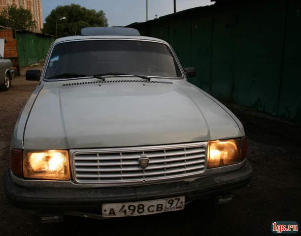
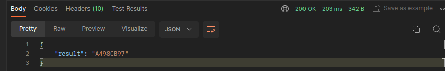

---

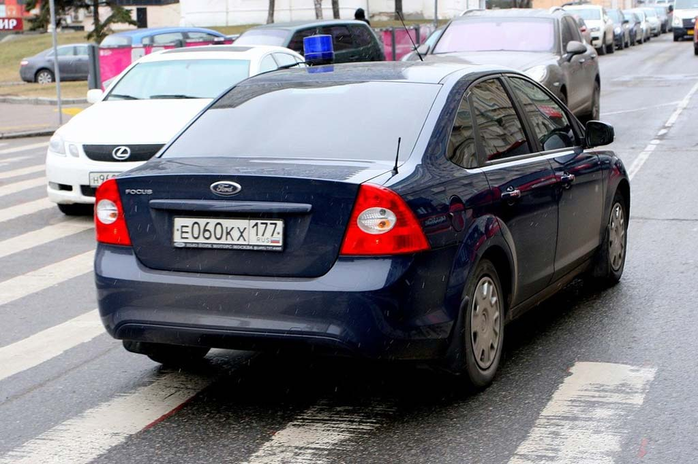


---

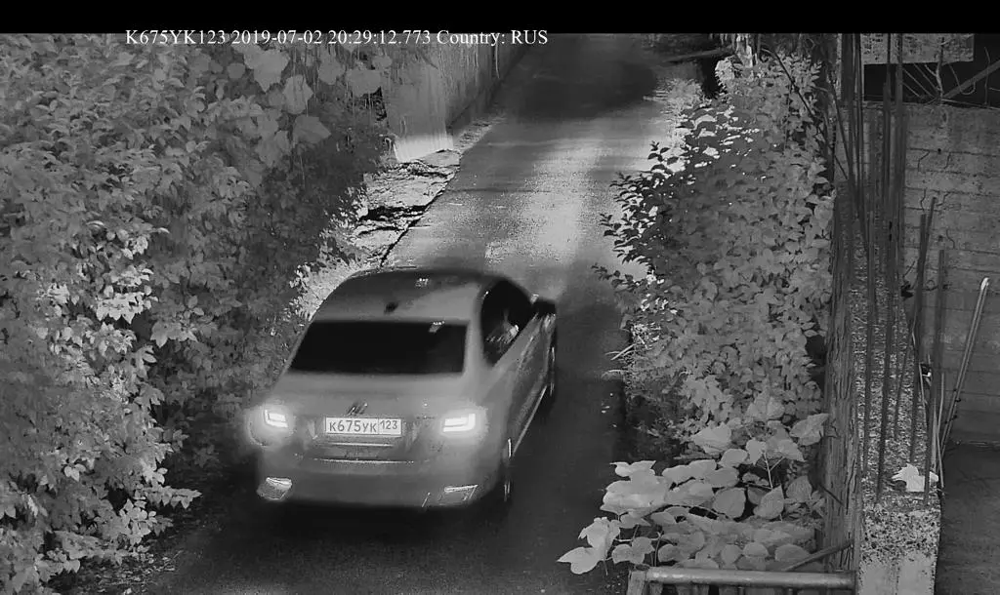
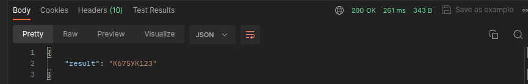

---

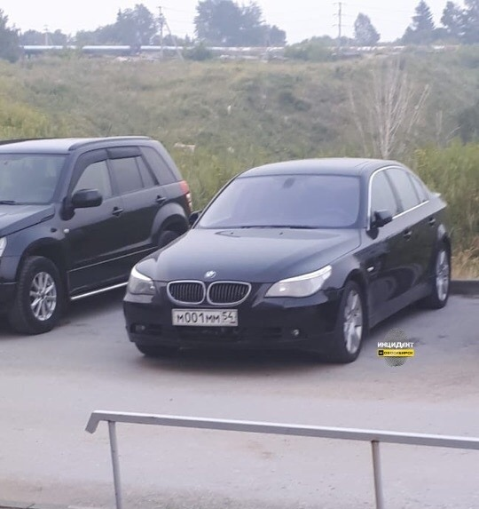


---

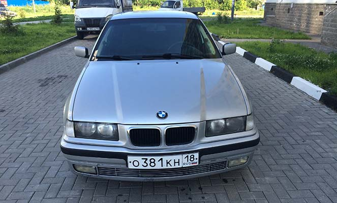


---


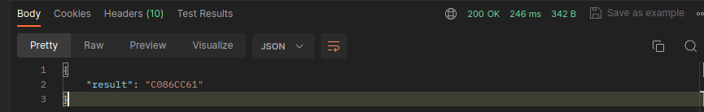

---

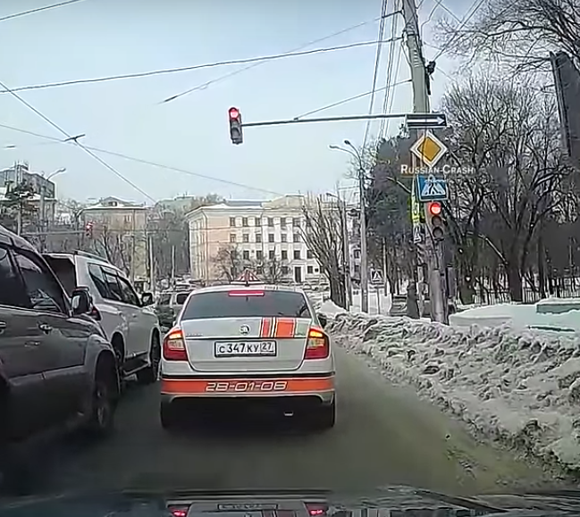
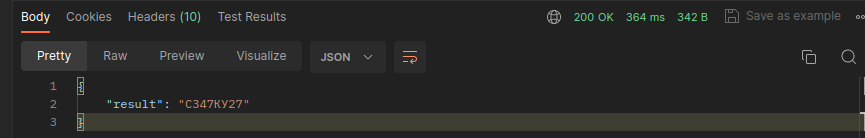

---

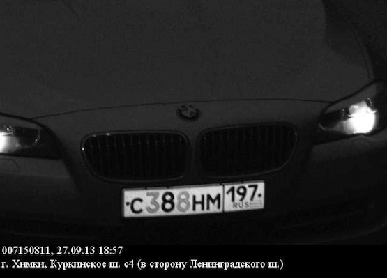
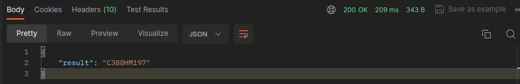

Среднее время обработки запроса - 250 миллисекунд.

## Начало работы

Для запуска сервиса нам нужно выполнить следующую команду:

```
pip install -r requirements.txt
```

Далее нужно изменить переменную окружения `DJANGO_SECRET_KEY` в файле `docker.env`. Для того чтобы его получить вам необходимо ввести следующую команду в терминал:

```
python3 src/manage.py shell -c "from django.core.management.utils import get_random_secret_key; print(get_random_secret_key())"
```

Подставляем его к `DJANGO_SECRET_KEY`

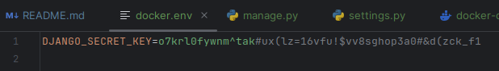

Наконец, запустим наш сервис в docker'е следующей командой:

```
docker-compose up -d --build; docker-compose logs -f
```

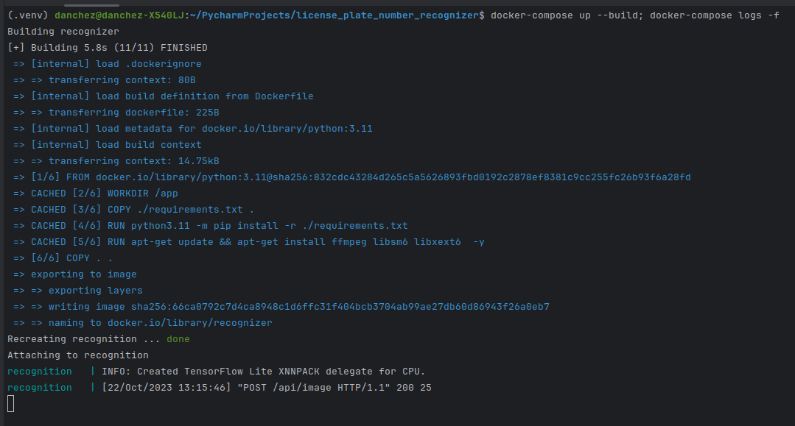

## Использование

Допустим есть следующее изображение с автомобилем:


Для распознавания регистрационного номера автомобиля можно воспользоваться библиотекой `requests` в python:

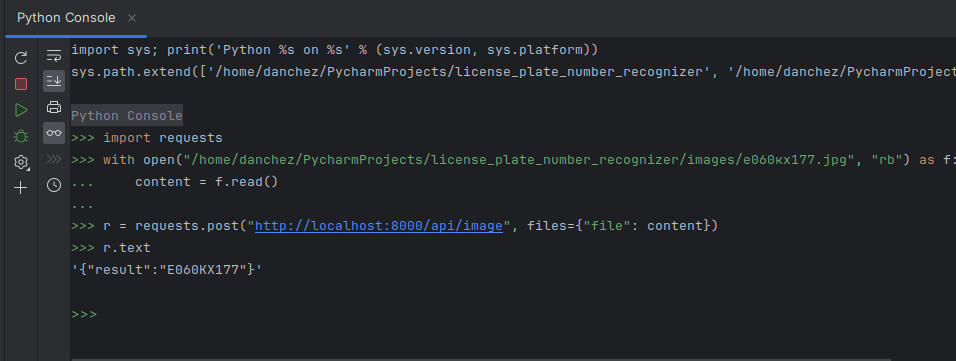

Также можно воспользоваться ПО Postman

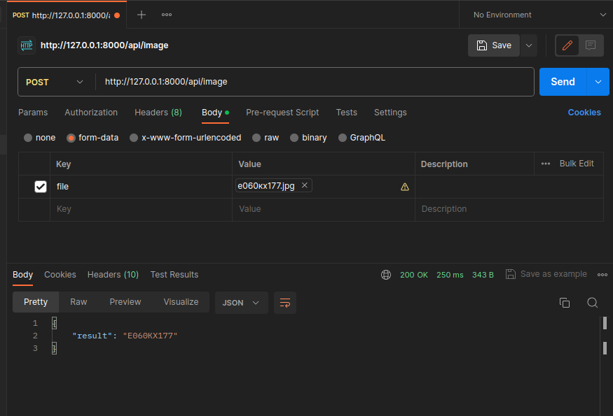


